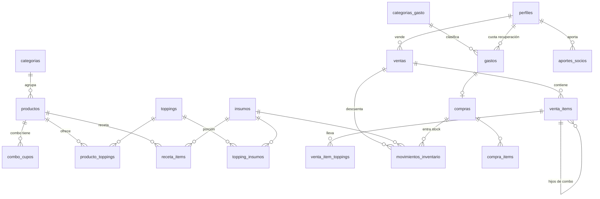

# Modelo de datos — Bendito Perro Caliente

Propuesta para revisar antes de escribir la app. El SQL completo y ejecutable está en
[`supabase/migrations/20260923000000_modelo_inicial.sql`](../supabase/migrations/20260923000000_modelo_inicial.sql)
y hay datos de ejemplo (precios provisionales) en [`supabase/seed.sql`](../supabase/seed.sql).

## Roles: misma tabla, no tabla aparte

Recomiendo **una columna `rol` en `perfiles`** (`empleado` | `socio`), no una tabla de roles.
Son 3 personas y 2 roles fijos; una tabla de roles/permisos solo añade joins y pantallas
de administración que nadie va a usar. Si algún día hace falta un tercer rol (ej. "cajero
de fin de semana"), se agrega un valor al enum sin reestructurar nada.

- `perfiles` se crea solo cuando se crea el usuario en Supabase Auth (trigger). Nace como `empleado`.
- Los socios se marcan como `socio` una vez (SQL o pantalla de admin).
- Hay que **desactivar el registro público** en Supabase Auth: los usuarios los crean los socios.
- Si la empleada se va, se pone `activo = false` y pierde acceso de inmediato.

## Diagrama

## Tablas

### Catálogo de venta (lo lee el POS)
| Tabla | Para qué |
|---|---|
| `categorias` | Pestañas del POS: Perros, Combos, Bebidas… |
| `productos` | Nombre, precio, `tipo` (`perro` / `bebida` / `acompanamiento` / `combo`). El `tipo` alimenta la tasa de adjunción. |
| `combo_cupos` | Qué trae un combo. Un cupo es un producto fijo ("Perro básico") o "cualquiera de una categoría" ("una bebida"). Combo Amigos = cupo Perro ×2 + cupo Bebida ×2. |
| `toppings` | Cebolla, tomate, pepinillo, papa, salsa de huevo, mostaza, queso + premium. |
| `producto_toppings` | Qué toppings ofrece cada perro, cuáles vienen marcados por defecto y cuánto cuestan de más **en ese perro** (el guacamole puede venir incluido en el mexicano y cobrarse en el básico). |

### Inventario (solo socios)
| Tabla | Para qué |
|---|---|
| `insumos` | Nombre, unidad (`g` / `ml` / `und`), costo por unidad, `stock_actual`, `stock_minimo`. |
| `receta_items` | Receta base del producto: 1 pan + 1 salchicha + 1 bandeja. |
| `topping_insumos` | Lo que gasta una porción de topping: queso = 20 g. |
| `movimientos_inventario` | **Libro de todo lo que entra y sale** (compra, consumo por venta, reverso, ajuste, merma). `stock_actual` se actualiza solo por trigger. De aquí sale el reporte de consumo por rango de fechas y "consumido vs. comprado". |
| `compras` / `compra_items` | Compra de insumos: suma stock y recalcula el costo del insumo por **promedio ponderado**. Se puede ligar al `gasto` correspondiente para no registrar dos veces. |

### Ventas
| Tabla | Para qué |
|---|---|
| `ventas` | Encabezado: método de pago, total, comisión datáfono, costo de insumos, quién vendió, `vendida_en` (hora de la tablet) y `registrada_en` (hora de llegada al servidor), estado (`completada` / `anulada`). |
| `venta_items` | Una línea por producto. Si es combo, los perros y la bebida del combo quedan como líneas hijas (precio 0) para que sus toppings y su consumo cuenten igual. Guarda precio y costo **del momento**. |
| `venta_item_toppings` | Toppings de cada línea → "top de toppings". |

### Gastos e inversión (solo socios)
| Tabla | Para qué |
|---|---|
| `categorias_gasto` | Cada categoría tiene `tipo`: `fijo` (arriendo, nómina), `variable` (insumos, empaques) o `inversion` (equipos, cuota de recuperación a socios). |
| `gastos` | Fecha, categoría, monto, descripción, quién lo registró, comprobante (foto en Storage) y, si es cuota de recuperación, a qué socio. |
| `aportes_socios` | Lo que puso cada socio. Saldo por recuperar = aportes − cuotas pagadas. |
| `parametros` | Valores con fecha de vigencia: % comisión Bold, cargo fijo, IVA sobre comisión, colchón de imprevistos (5 %), cuota de recuperación… Si Bold cambia tarifa, se agrega una fila nueva y el histórico no se altera. |

## Cómo se registra una venta

Una sola función `registrar_venta(payload)` en la base de datos, **atómica**: o se guarda
todo (venta, líneas, toppings, descuento de inventario, comisión) o nada.

1. La tablet genera el `id` (UUID) de la venta **antes** de enviarla.
2. Si no hay internet, la venta se guarda en la tablet (IndexedDB) y se reintenta sola.
3. Si el reintento llega dos veces, el mismo `id` hace que la segunda vez devuelva la venta ya
   guardada en vez de duplicarla.
4. Los precios los pone el servidor, no la tablet.
5. Descuenta insumos = receta de cada línea + toppings elegidos.
6. **El inventario puede quedar en negativo**: nunca se bloquea una venta porque el
   sistema "cree" que no hay queso. Un negativo es señal de que falta registrar una compra
   o ajustar la receta.

Anular una venta (`anular_venta`) es solo para socios, pide motivo y devuelve el inventario.

## Seguridad (RLS)

- **Empleada**: lee el catálogo de venta (productos, precios, toppings). Vende con
  `registrar_venta`. Ve "ventas de hoy" (sin costos, para cuadrar caja) y alertas de
  stock bajo (solo nombre y cantidad, sin costos). No puede leer insumos, costos, gastos,
  márgenes ni parámetros, ni siquiera llamando la API directamente.
- **Socios**: todo.
- Ventas e inventario **no se pueden escribir directo**, solo por las funciones.

## Tiempo real

`ventas`, `gastos` e `insumos` están publicados en Supabase Realtime. El dashboard escucha
esos cambios y recalcula. Realtime respeta RLS: solo los socios reciben los eventos.

## Métricas del dashboard: de dónde sale cada una

| Métrica | Fuente |
|---|---|
| Ventas día/semana/mes | `ventas.total` (estado `completada`), agrupado en hora de Bogotá |
| Margen de contribución | `total − costo_insumos − comision_datafono − colchón %` |
| Punto de equilibrio | gastos `fijo` del mes (+ cuota de recuperación) ÷ margen unitario — **pendiente tu fórmula exacta** |
| Ventas por hora | `ventas.vendida_en` |
| Top toppings | `venta_item_toppings` |
| Tasa de adjunción de bebidas | ventas con ≥1 línea `bebida` ÷ ventas con ≥1 línea `perro` (combos incluidos) |
| Efectivo vs. datáfono | `ventas.metodo_pago` |
| Consumo por insumo | `movimientos_inventario` tipo `consumo_venta` − `reverso_venta`, vs. tipo `compra` |

Las consultas del dashboard se harán como funciones SQL en la siguiente fase, cuando
tengamos tu lógica de costeo.

## Decisiones que necesito que confirmes

1. **Punto de equilibrio y cuota de recuperación**: pásame la fórmula de tu calculadora.
   Por ahora el modelo guarda todos los insumos para calcularla (costos fijos vía gastos,
   comisión por venta, colchón %, aportes y cuotas por socio).
2. **Tarifa Bold QR**: % y cargo fijo reales (quedaron en 0 en `parametros`).
3. **Combos**: ¿los mantienen (Sencillo, Amigos…)? El modelo ya los soporta con bebida a elección.
4. **Costo de insumos**: propuse promedio ponderado automático al registrar compras.
   ¿Prefieren último precio de compra o costo fijo editado a mano?
5. **Anulaciones**: ¿solo socios, o la empleada puede anular una venta recién hecha
   (ej. dentro de 5 minutos) por error de digitación?
6. **Cierre de caja**: ¿quieren un registro de turno (base inicial, efectivo contado al
   cierre, diferencia)? Es una tabla más y ayuda mucho a controlar efectivo.
7. **Toppings "por defecto"**: asumí que en el básico todos los clásicos vienen marcados y la
   empleada desmarca ("sin cebolla"). ¿Así funciona en el mostrador?
