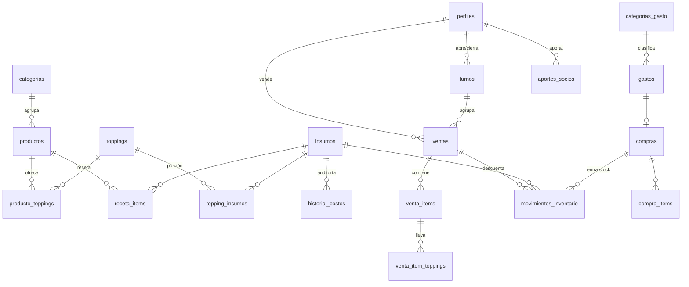

# Modelo de datos — Bendito Perro Caliente

SQL completo y ejecutable:
[`supabase/migrations/20260923000000_modelo_inicial.sql`](../supabase/migrations/20260923000000_modelo_inicial.sql).
Cambios posteriores: [`20260924000000_variantes_y_plan_recuperacion.sql`](../supabase/migrations/20260924000000_variantes_y_plan_recuperacion.sql).
Datos de arranque (precio y costos reales del 23-sep-2026; gramajes estimados): [`supabase/seed.sql`](../supabase/seed.sql).

## Roles

Una columna `rol` en `perfiles` (`empleado` | `socio`). El perfil se crea solo al crear
el usuario en Supabase Auth y nace como `empleado`. El registro público de Supabase Auth
debe estar **desactivado**: los usuarios los crean los socios. `activo = false` corta el
acceso de inmediato.

## Diagrama



## Tablas

### Catálogo de venta (lo lee el POS)
| Tabla | Para qué |
|---|---|
| `categorias` | Pestañas del POS: Perros, Bebidas… |
| `productos` | Nombre, precio, `tipo` (`perro` / `bebida` / `acompanamiento`). No hay combos: la bebida es otra línea de la misma venta. |
| `toppings` | Papa, queso, salsa de huevo, salsa rosada, mostaza, pepinillo (y premium a futuro). `grupo` agrupa **variantes excluyentes**: Papa = ripio \| hojuela, Queso = doble crema \| Saravena. El cliente elige una y cada variante tiene su propio insumo, así el costo de cada venta es el de la variante usada. |
| `producto_toppings` | Qué toppings ofrece cada perro, si vienen **premarcados** (los clásicos sí, los premium no) y su precio extra **en ese perro**. |

### Inventario (solo socios)
| Tabla | Para qué |
|---|---|
| `insumos` | Unidad (`g` / `ml` / `und`), costo promedio, stock actual y mínimo, `es_estimado` (costo por confirmar) y `nota` (proveedor, presentación). El stock no se edita a mano: solo se mueve con movimientos. |
| `receta_items` / `topping_insumos` | Receta base del producto y consumo de cada porción de topping. `es_estimado` marca los gramajes pendientes de validar con gramera. La salsa de huevo consume 0,5 huevo + 5 g de cebolla. |
| `movimientos_inventario` | Libro de entradas y salidas: `inicial`, `compra`, `consumo_venta`, `reverso_venta`, `ajuste`, `merma`. De aquí salen el stock y el reporte de consumo vs. compras. |
| `compras` / `compra_items` | Cada compra suma stock y recalcula el **costo promedio ponderado**: `(stock × costo actual + costo de la compra) ÷ (stock + cantidad comprada)`. |
| `historial_costos` | Registro de cada cambio de costo, con origen (`compra` / `manual`), motivo, quién y cuándo. El ajuste manual solo se puede hacer con `ajustar_costo_insumo(...)` y motivo; un cambio directo se rechaza. |

### Ventas y caja
| Tabla | Para qué |
|---|---|
| `ventas` | Método de pago, total, comisión datáfono (1,5 %), costo de insumos, turno, `vendida_en` (hora de la tablet) y `registrada_en` (llegada al servidor). Si está anulada, el motivo es obligatorio (lo exige la base de datos). |
| `venta_items` / `venta_item_toppings` | Líneas y toppings con precio y costo del momento. |
| `turnos` | Base inicial, ventas en efectivo del turno, efectivo esperado, efectivo contado y **diferencia**. Solo puede haber un turno abierto. |

### Gastos e inversión (solo socios)
| Tabla | Para qué |
|---|---|
| `categorias_gasto` / `gastos` | Tipo `fijo`, `variable` o `inversion`; monto, fecha, quién registró, comprobante, y socio si es una cuota de recuperación pagada. |
| `planes_recuperacion` | Número de meses y mes de inicio. `monto_total` = suma de sus conceptos. Cuota = monto ÷ meses, y solo aplica dentro de esos meses. Mientras `inicia_en` esté vacío, la cuota se proyecta en todos los meses. |
| `plan_recuperacion_items` | Conceptos de la inversión (muebles, nevera, envío, salchichera, puesto). Agregar uno (utensilios, uniformes) sube el total solo. |
| `aportes_socios` | Cuánto puso cada socio (para repartir las cuotas). |
| `parametros` | Valores con vigencia: comisión Bold 1,5 %, % merma, días de operación, nómina, arriendo, y estimados para meses sin ventas. Cambiar un valor = fila nueva con fecha, sin alterar el histórico. |

## Reglas de negocio implementadas

- **Registrar venta** (`registrar_venta`): atómica e idempotente (la tablet genera el UUID;
  si reintenta, no se duplica). Precios del servidor. Descuenta receta + toppings. Asigna el
  turno en que cayó la venta. Nunca bloquea una venta por stock (puede quedar negativo).
- **Anular** (`anular_venta`): motivo siempre obligatorio. La empleada puede anular **sus**
  ventas durante los 5 minutos siguientes a registrarlas; después, solo un socio. Devuelve el
  inventario.
- **Caja**: `abrir_turno(base)`, `turno_actual()`, `cerrar_turno(contado, notas)`. El conteo es
  a ciegas: la empleada cuenta sin ver cuánto "debería" haber, y al cerrar ve el cuadre.
- **Seguridad (RLS)**: la empleada solo lee el catálogo y usa esas funciones; ventas del día y
  alertas de stock sin costos. Los socios ven todo.
- **Tiempo real**: `ventas`, `gastos`, `insumos` y `turnos` publicados en Realtime (solo los
  socios reciben eventos).

## Punto de equilibrio — `punto_equilibrio(mes)`

Tal cual la fórmula de la calculadora:

```
costo por perro   = insumos de la receta × (1 + % merma)
                    + precio × % comisión datáfono × % ventas con datáfono
margen por perro  = precio − costo por perro
margen bebida     = (precio bebida − costo bebida) × % ventas que incluyen bebida
margen combinado  = margen por perro + margen bebida
cuota recuperación= inversión ÷ meses   (solo dentro del plazo del plan)
costos fijos      = nómina + arriendo + cuota recuperación
PE unidades/mes   = costos fijos ÷ margen combinado
PE unidades/día   = PE mes ÷ días de operación
PE pesos/mes      = PE unidades × precio
```

- Precio, costo, % datáfono y % con bebida salen de las **ventas reales del mes**
  (promedio ponderado entre perros). Si el mes todavía no tiene ventas, usa catálogo y
  parámetros estimados; el resultado indica `fuente`.
- La cuota se evalúa según el mes consultado: al cumplirse el plazo sale sola de los costos
  fijos y el PE baja, sin tocar nada.
- También devuelve el margen de contribución real acumulado en el mes y el % de avance
  contra los costos fijos.

## Pendiente de datos reales

- Gramajes de toppings y huevo: estimados (`es_estimado = true`), validar con gramera.
- Costo de la cebolla cabezona: estimado de mercado.
- Merma 3 %: provisional.
- Bebidas: precio y costo.
- Nómina y arriendo: valores del caso de negocio, por confirmar.
- Plan de recuperación: fecha de inicio, y los conceptos de utensilios y uniformes.
